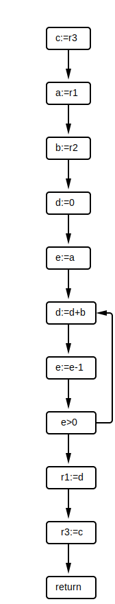

# Control-Flow

Give three examples of control-flow in an imperative language:

- Sequential (statements)
- Conditional (if / switch / case)
- Looping (while / do while / for / foreach / loop)
- Exceptions (throw / try / catch / finally)
- Continuations (call/cc)
- Async-await (threading)
- Coroutines / Generators (yield)
- Dispatch (function calls / method calls)
- Loop jumps	break / continue

# Control-Flow Graphs

Consider the following code in an intermediate representation. Construct a control-flow graph of the program. 

   

## Basic blocks

Construct a control-flow graph with basic blocks. 

   

# Live Variables

1. Explain what it means for a variable to be live:

   A variable is live if it holds a value that may be observed (read) in the future of the program. The writer of the liveness analysis defines which variables are live at the end of the program. 

2. Show the results of a live variables analysis on the above program for each line, at the point in the program before that line is executed. Consider variables `r1`, `r2` and `r3` live outside the program. 

               c := r3           // { r1, r2, r3            }
               a := r1           // { r1, r2,       c       }
               b := r2           // {     r2, a,    c       }
               d := 0            // {     r2, a, b, c       }
               e := a            // {     r2, a, b, c, d    }
          l1:  d := d + b        // {     r2,    b, c, d, e }
               e := e - 1        // {     r2,    b, c, d, e }
               if e > 0 goto l1  // {     r2,    b, c, d, e }
               r1 := d           // {     r2,       c, d    }
               r3 := c           // { r1, r2,       c       }
               return            // { r1, r2, r3            }
