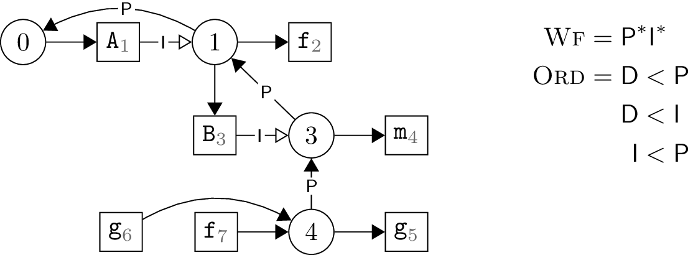

## Name Resolution with Scope Graphs

The main aspects are:

- The name binding structure of a program is represented as a graph of
  scopes, references, and declarations.
- Resolving a reference is finding a path in the graph from the
  reference to a matching declaration.
- The paths used for resolution must be well-formed, which means the
  labels must match a given well-formedness regular expression.
- Disambiguation defines which declarations are visible if multiple
  matching declarations can be reached. Disambiguation is specified
  using an ordering on path labels.

## Resolving in Scope Graphs

1. The resolution of _f8_ involves an import of
   _A7_. This import has two reachable declarations:

   * _A7 &middot; R &middot; #2 &middot; P &middot; #0 &middot; D &middot; A2_
   * _A7 &middot; R &middot; #2 &middot; D &middot; A4_

   According to the label order _Ord_, the path to _A4_
   shadows the path to _A2_. Therefore, reference
   _A7_ resolves to _A4_.

   Given that, there is one reachable declaration for _F8_,
   which is:
   
   * _f8 &middot; R &middot; #4 &middot; I &middot; #3 &middot; D &middot; f6_

   Because there is only a single resolution path, the reference is
   resolved to declaration _f6_.

2. The import _A5_ has one reachable declaration, which is:

   * _A5_ &middot; R &middot; #0 &middot; D &middot; _A1_

   Since there is only a single path, _A5_ resolves to _A1_.

   The import _B7_ has one reachable declaration, which is:

   * _B7_ &middot; R &middot; #3 &middot; P &middot; #0 &middot; D &middot; _B4_

   Since there is only a single path, _B7_ resolves to _B4_.

   Finally, the reference has two resolution paths, which are:

   * _f8_ &middot; R &middot; #3 &middot; P &middot; #0 &middot; D &middot; _f9_
   * _f8_ &middot; R &middot; #3 &middot; I &middot; #2 &middot; I &middot; #1 &middot; D &middot; _f3_

   According to the label order _Ord_, the path via the imports takes
   precedence over the path via the lexical parent. Therefore,
   _f8_ resolves to _f3_.

## Constructing Scope Graphs

1. The corresponding scope graph is given by:

   

2. The corresponding scope graph is given by:

   

